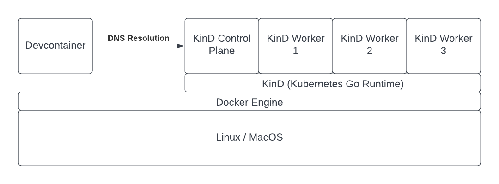

Fireworks is a platform for cloud native development of distributed applications.

Fireworks aims to be a production ready development environment for streaming stateful/stateless ETL and streaming Dashboarding. The purpose of Fireworks is to provide a minimal implementation of a modern streaming Data Warehouse using popular technologies that can be deployed to a production kubernetes cluster (such as Amazon EKS or Google GKE) with minimal additional configuration.

# Table of Contents  

[Tech Stack](#tech-stack)  
[Getting Started](#getting-started)  
[Development Container](#development-container)  
[Apache Spark](#apache-spark)  
[Apache Kafka](#apache-kafka)  
[Open Telemetry](#open-temeletry)

# Tech Stack

Fireworks makes use of the following technologies.

* Containerd
* Docker
* K3S (and K3D) for lightweight Kubernetes at the edge and datacenter
* Helm
* Apache Kafka - The distributed message queue
* Apache Spark - Distributed Query Engine
* Python - Large Language Model Byte Code
* Node.js Middlware Websocket proxy

# Getting Started

This project requires Docker to run. It has been tested on x86 and ARM CPU architectures. The reference deployment is a Debian based linux environment.

This project packages all development tools into a single container called a Devcontainer. This toolchain is then used to deploy services into the host systems. You can run the test suite and observe the outputs by running the following command:

```
git clone https://github.com/The-Fireworks-Company/Fireworks.git && bash bootstrap.sh test
```

This will use the Docker Engine of the host and bind to the var/run/docker.sock to create the Devcontainer, open it via a terminal, and bootstrap the project. Once everything is built it will then run the test suite using pytest and print results to the terminal.

Alternatively you can run this project using the VS Code Devcontainer extension. Simply clone the repo, open it in VS Code, and click "open in container" on the bottom left.

# Development Container

The Devcontainer is configured to use IP Tables to resolve Kubernetes internal services using CoreDNS hosted in the Kind Control Plane using the Docker Engine as a bridge on the host's network. This allows anything run within the Devcontainer to reach local Kubernetes services using the same URL as it would inside the Kubernetes cluster!

i.e.

```
ping service_name.namespace.svc.cluster.local
```

Is resolvable in the Devcontainer.

This is basically a blanket kubectl proxy command but since it is run within the Devcontainer (and Docker Engine) it is agnostic to the underlying operating system's networking approach. Further this Devcontainer can be used with minimal configuration to forward kubectl commands to any cloud provider (AWS, GCP, etc).

The **Kubernetes** cluster is run using K3D (K3S in Docker by Rancher Labs).


