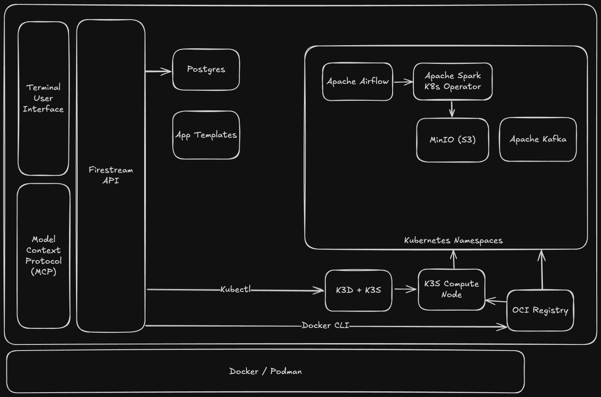

<!--
License
<!-- START Firestream -->
# Firestream
[](https://www.apache.org/licenses/LICENSE-2.0.txt)
[](https://github.com/psf/black)


<picture width="500">
  
</picture>

Firestream is a serverless data warehouse designed to fill the gaps left by the use-case-specific point solutions that make up the average data engineer's toolbelt.

Inspired by OpenStack, Firestream is a easy to deploy fully local K3S cluster than can easily be shipped to production in GCP or AWS. Think of it as the "create-react-app" for data warehousing, evolving into a comprehensive stack tailored for Data Scientists by Data Engineers.

Setups differ widely among machines and environments. Even modern solutions like Bytewax require an external kubernetes setup to run their own workflows. But what if you need to deploy a new API to intake data? Need to setup Airflow? Spark Cluster? Minio? A new internal microtool with that one library? In a secure environment that is accessible based on RBAC? What about the Kitchen Sink? Firestream will generated kubernetes deployments for you! (provided you adopt the config, RBAC TBD)

Firestream adopts the Dataflow paradigm, ensuring data is touched minimally throughout its lifecycle. Acknowledging that data has gravity and prefers to stay in place, Firestream emphasizes the necessity of highly specific ETL processes required for modern data meshes, namely receiving streaming data and processing it.

The name "Firestream" combines the idea of "firing up" an instant data solution with "stream" representing the continuous data flow, mirroring how the tool provides quick deployment of data streaming infrastructure.

## Key Features
* ETL Configuration: Customize your ETL jobs in Python using classes to represent whole apps.

* Reverse Compatibility: Seamlessly integrates with Apache Airflow as the orchestrator, ensuring compatibility with existing workflows.

* Production-Ready Environment: A robust development environment for both stateful and stateless ETL and streaming dashboarding, ready for production deployment with minimal configuration.


# Comps

The best way to understand Firestream is to compare it to the landscape of Data Tools and Cloud Providers

| Tool/Platform            | Cloud Support                  | Runs on a Laptop | Dynamic Scalability | Code your own ETL | Real-Time Streaming Source | Real-Time Streaming Effects | Built on Open Source | Identity Management | User-Friendly Interface         | Kubernetes as a Service | BI Tool Compatible                    |
|--------------------------|--------------------------------|------------------|---------------------|-------------------|----------------------------|----------------------------|-----------------------|----------------------|----------------------------------|------------------------|---------------------------------------|
| Firestream               | Yes, deploy to arbitrary VM(s) | Yes              | Yes                 | Yes               | Webhooks, Websocket, REST  | Webhooks, Websocket, REST  | 100%                  | #TODO                | CLI, IDE (vscode), Services Interfaces | Yes                    | Apache Hive 2.0 API w integrated Catalog |
| Amazon Redshift          | Yes                            | No               | Yes                 | Yes               |                            | No                         | ~90%, postgres        | Yes                  | GUI                              | No                     | Widely Supported                      |
| Google BigQuery          | Yes                            | No               | Yes                 | Yes               |                            | No                         | 0%                    | Yes                  | Yes                              | No                     | Widely Supported                      |
| Microsoft Azure Synapse  | Yes                            | No               | Yes                 | Yes               |                            | No                         | 0%                    | Yes                  | Yes                              | No                     | ?                                     |
| Snowflake                | Yes                            | No               | Yes                 | Yes               |                            | No                         | 0%                    | Yes                  | Yes                              | No                     | Widely Supported                      |
| Databricks               | Yes                            | No               | Yes                 | Yes               |                            | No                         | 90%, spark            | Yes                  | Yes                              | No                     | Widely Supported                      |
| Google Cloud Platform (GCP) | Yes                         | No               | Yes                 | Yes               |                            | With dedicated project     | Extensive             | Yes                  | Yes                              | Yes                    | N/A                                   |
| Amazon Web Services (AWS) | Yes                           | No               | Yes                 | Yes               |                            | With dedicated project     | Extensive             | Yes                  | Yes                              | Yes                    | N/A                                   |


# Table of Contents

[Tech Stack](#tech-stack)
[Getting Started](#getting-started)
[Development Container](#development-container)
[Apache Spark Structured Streaming](#apache-spark-structured-streaming)
[Python Stateful Streaming](#python-stateful-streaming)
[Node.js Middleware](#node-middleware)
[Plotly.js Dashboard](#plotly-dashboard)

# Tech Stack

Firestream is powered by these core technologies.


* [Development Container](https://github.com/devcontainers)
* ["Docker-From-Docker"](https://github.com/devcontainers/features/tree/main/src/docker-outside-of-docker)
* [k3s](https://k3s.io/)
* [k3d](https://github.com/k3d-io/k3d)
* [Helm](https://helm.sh/)
* [Bitnami Charts](https://github.com/bitnami/charts)
  * [Minio](https://github.com/bitnami/charts/tree/main/bitnami/minio)
  * [Kafka](https://github.com/bitnami/charts/tree/main/bitnami/kafka)
  * [Postgres](https://github.com/bitnami/charts/tree/main/bitnami/postgresql)
  * [Contour (Envoy)](https://github.com/bitnami/charts/tree/main/bitnami/contour)
* [Spark via Spark Operator](https://github.com/kubeflow/spark-operator)


# Getting Started

This project requires `containerd` and a x86 / AMD64 / Arm64 linux host.

It has been tested on MacOS with Docker Desktop and Ubuntu using Podman.

This project implements **Infrustructure as Code** via a Devcontainer (Development Container) defined in a Dockerfile. The project can be run using the following command:

```

git clone https://github.com/datawizz/firestream.git && cd firestream && python bootstrap.py

```

This will use the Docker Engine of the host and bind to the var/run/docker.sock to create the Devcontainer, open it via a terminal, and bootstrap the project. You will be guided through configuration of the environment.

Alternatively you can pass a JSON file describing the desired deployment like so.


```
python bootstrap.py path/to/json/config.json
```

Example minimal config

```json
{
  "services": [
    {
      "service_name": "airflow",
      "resources": {
        "requests": {
          "cpu": "200m",
          "memory": "128Mi"
        },
      },

    {
      "service_name": "kafka",
      "resources": {
        "requests": {
          "cpu": "200m",
          "memory": "128Mi"
        },
      },
    },
    "service_name": "bigquery",
      "resources": {
        "requests": {
          "cpu": "200m",
          "memory": "128Mi"
        },
      },
  ],
  "image": {
    "repository": "python:",
    "tag": "3.9-slim",
    "pullPolicy": "IfNotPresent"
  },
  "service": {
    "ports": [80,443]
  },
  "replicaCount": 1,
  "resources": {
    "requests": {
      "cpu": "200m",
      "memory": "128Mi"
    },
  },
  "ingress": {
    "enabled": false,
    "external": false
  }
}

```

# Development Container

Alternatively you can run this project using the VS Code Devcontainer extension. Simply clone the repo, open it in VS Code, and click "open in container" on the bottom left.

The Devcontainer is configured to use IP Tables to resolve Kubernetes internal services using CoreDNS hosted in the Kind Control Plane using the Docker Engine as a bridge on the host's network. This allows anything run within the Devcontainer to reach local Kubernetes services using the same URL as it would inside the Kubernetes cluster!

i.e.

```
ping service_name.namespace.svc.cluster.local
```

Is resolvable in the Devcontainer.

This is basically a blanket kubectl proxy command but since it is run within the Devcontainer (and Docker Engine) it is agnostic to the underlying operating system's networking approach. Further this Devcontainer can be used with minimal configuration to forward kubectl commands to any cloud provider (AWS, GCP, etc).

The **Kubernetes** cluster is run using KinD (Kubernetes in Docker).




### Apache Spark Structured Streaming

Data is generated using a PySpark application which sends data to the "metronome" topic in Kafka. This application uses the Spark Rate-Micro-Batch (new in Spark 3.3) to generate exactly 1 record per second advanced. This simulates a monotonically increasing measurement from some sensor.

This stream is joined to a small table to create multiple sensor readings on the same update frequency. The field DeviceID is used to partition the output before writing to Kafka.

A second Spark application in Scala reads from the topic "metronome" and performs Stateful Stream Processing in which the N-1 record is compared with the Nth record to find the next advance in the Wiener process. Scala is used here since the "MapGroupsWithState" function is currently only available using the Scala API.

### Python Stateful Streaming

For a comparison of performance a Python application is configured to read data from the "metronome" topic in Kafka. Similar to the Spark Scala application the goal is to merge the N-1 and Nth events in the stream coming from a Kafka topic to demonstrate a Wiener process.

### Node Middleware

Kafka is great for internal communication between microservices but it is not ideal for clients to connect to directly due to the need to secure it and scale it 1-1 with the clients that are connected. Instead a middleware service is implemented which reads the events from Kafka and publishes the events one by one to all connected websocket clients. Events from Kakfa are read and added to a queue. Asynchronously the queue is read and sent to all connected websocket clients.

### Plotly Dashboard

Plotly is a powerful library for data visualization and provides bindings in Python to make a Data Scientist's life easier. But in the realm of quickly updating dashboards the Python layer is simply too slow.

Implemented here is the Plotly JS library rendered client side using NextJS and React. The single page application subscribes to the Websocket connection provided by the middleware and updates events every 100 milliseconds.

The dashboard is available at localhost:8000


1. Setup Kyuubi to build a Spark Driver/Worker container with all dependencies (from the build.sh)

2. Setup Superset to have a default Database in Hive / Kyuubi

3. Setup Spark Catalog to load the SPIDER dataset and BIRD dataset

4. THE MVP - Develop CTEs for Abstract Tools over the database.
    1. Review the database table by table.
        Use the "Contraint" to find the forgien keys
        Map this into DataModel definition?

Benchmark it!
<https://bird-bench.github.io>
The SOTA is 43% accuracy on text to SQL commands???

Run these SQL commands one at a time through GPT4
/workspace/tmp/data_plugins/bird/train/train_gold.sql

Each and every Table in any database has the following

class Column(DataModel):
    """
    Defines the abstraction of a Column within a Table, with all the assumptions of ANSII SQL.

    A column is the primary abstraction of a table.
    """

    id: UUID
    name: str
    datatype: UNION[*ALLOWED_TYPES]
    count: Int # The number of elements in this column.

    partition_by: bool # If this column should be used in the partitioning logic
    index: bol
    index_with: list[str] # An array of strings representing columns in this Coulumn's Table that should be co-located with this column when partitioning


    # Statistical Properties
    # Uncertainty in Statistical Properties # This value should be updated via the function library

    # A 10 word description
    # A 100 word description
    # A 1000 word description

    def sample(self):
        """
        Randomly sample a segment of data from the column to understand its properties.
        Update the certainty according to how much of the dataset has been explored this way.
        Make extension use of partitioned columns

        """


    def sample_statistics(self):
        """
        Find the mean, median, standard deviation, etc for the distribution of the columns actual values by sampling them
        """

class Table(DataModel):
    """
    Defines the abstraction of a Table with all the assumptions of ANSII SQL.

    Extends the definition to include metadata required for various operations.

    """

    id: UUID # A universally unique ID
    name: str # The name to refer to in SQL statements
    columns: array[str] # An array of undeleted columns that are queriable.

The demand for the deployment of AI will outpace the supply of execution environments when the model size is beyond a few hundred billion wegihts.

Langchain implements Spark SQL.

Need to setup DataContext to create and manage the branch of the Agent.
The DataContext should intercept all the SQL that is run, send it to Kafka as a log,
and then discard any agent supplied SQL that contains a modififction to the branch that is being accessed.

Therefore whatever is returned and run in SQL will be limited to that instance of the agent which is created at runtime.

Benchmark it!
<https://bird-bench.github.io>
The SOTA is 43% accuracy on text to SQL commands???

Run these SQL commands one at a time through GPT4
/workspace/tmp/data_plugins/bird/train/train_gold.sql

1. Submodules must be cloned to be used in "make demo"
    This depends on Git being able to access the private repos in the repo...

2. Superset requires "helm dependency build" before it will run. Should this be glued to the Firestream implementation?

3. The machine that the repo is run on requires access to git "inside" the contianer, which is not setup from the local environment automatically.


####


create a template for new projects
1. helm chart
2. dockerfile
3. standardized makefile relative to project root
4. python cli like create-t3-app

include

airflow


# MVP

The goal is a research platform. Features are required:

1. Enter a start, end, and interval to a DataFactory and download data from Polygon for that period. Store it in Parquet files locally in S3.
2. Enable a "cache" flag in the DataFactory which indicates that DataModel intermediate results should be written to S3.
3. Enable a "Streaming" flag on DataFactory that communicates with Kafka using Spark Streaming.
3.1. Enable Start, End, Interval flags to work in batch mode with Kafka as a source. Create a cronjob which backs up Data in Kafka to S3. Use the scheduled K8 executor CRD?


# Spark History Server

Use the project's dockerfile to add a build stage which creates a Spark History image
that uses SPARK_HOME and the sbin/spark_history_server.sh to run the server

Add in the correct configurations to allow it to pull from S3 logs directory

Add a local docker registry

Create a HELM chart which uses the image to create a K8 pod that exposes the spark history server to localhost:80 etc


-> Or introduce the widget?


1. Setup Spark History Server
2. Deploy Spark History Server on K8s


1. Persistent volume claim for Spark history server
2. run spark history server as pod
3. load balancer and forward port to "host"

	test -> curl -L http://$(kubectl get svc history-server-ui-lb -n spark --output jsonpath='{.status.loadBalancer.ingress[*].hostname}')


# ML Flow

Use the ML Flow UI in a Dockerfile
Use a static release -> https://github.com/mlflow/mlflow/archive/refs/tags/v2.0.1.zip
Include it in the download section of the Dockerfiles.


Tracking! The tracking signature is the hash of the Spark SQL that is used to process?! Plus python code I guess...


/k8 to accept incoming logging requests from within the cluster
https://mlflow.org/docs/latest/tracking.html

Other components don't need to be registered

-> Create a extension to DataContext which uses the ML Flow tracking endpoint (how to expose in the cluster and outside it???)


# Read and Write to S3

Extend DataSource and DataSink to support S3

# Read and Write to From Kafka

#Extend DataSink and DataSource to support Kafka


# Bench marking

Create a Spark job with benchmarks data moving through Kafka

# Actual ML Inference

Implement the GARCH model using PyTorch
Save the Model
Load the Model and Launch it streaming against Kafka


# Issues

Spark has logging=info set in the default config somehow, very verbose

Should have the KIND cluster use a local project folder for S3 assets. Hopefully Parquet files are openable directly from the filesystem like this.

# MVP


A notebook which does the following:

1. Reads data from yfinance for 1 min candles in the last 30 days
2. Use the Candles to train a model (GARCH) that makes predictions
3. Feed the candles into a Kafka topic and read them out in a stream.
    Make a Python function which take a observation from a DataFrame, loads the model, makes inference over it, and outputs a prediction in another Kakfa topic


-> Task

Create a Streaming Pipeline that takes Spark generated event times, blends with some data,
and passes to Kafka

Create a Pipeline which extracts datetime offsets from Kafka and pushes to S3 parquet


Sin waves!

There should be a Sin function for each interval of time.
The output embedding is actually over the point in the sin wave as opposed to a discrete measure of time.


*** Sources ***

<https://jboothomas.medium.com/running-spark-on-kubernetes-with-persistent-storage-24b7903bb40a>


***Issues***


Remove GoogleCloud secrets. Assume a demileraterized zone for all (no auth internally)

PySpark seemingly cannot be installed from the directory in the Dockerfile but can be from the exact same local extract?
https://spark.apache.org/docs/latest/building-spark.html

***MVP Features***

* DataContext, Sink, Source
    Update the path string builder in DataContext to partition parquet data before saving in S3
    Update the S3 DataSink to include this interface
    Integrate DataSink and DataSource to use the Kafka cluster.
    Finish DataSource of y finance

* MinIO
    MinIO should be used for S3 source for better performance than localstack. Also localstack is heavy weight for the use case here.
    <https://github.com/minio/minio/tree/master/helm/minio>
    <https://www.oak-tree.tech/blog/spark-kubernetes-minio>
    <https://spark.apache.org/docs/latest/cloud-integration.html>
    Set the persistent volume to be a local directory .data for all buckets


    --> Use the helm install --set syntax to use credentials from the environment
    $ helm install --set accessKey=myaccesskey,secretKey=mysecretkey --generate-name minio/minio


* SparkClient
    Setup Spark to send it's logs to S3

    Adjust the log level of the sparkClient to default to warnings
    this is related to the install from source used in spark

    <https://blog.mkari.de/posts/spark-on-k8s/>
    <https://spot.io/blog/setting-up-managing-monitoring-spark-on-kubernetes/>
    <https://sparkbyexamples.com/spark/spark-web-ui-understanding/>


* Setup Spark History Server to read logs from S3
    https://github.com/carlosescura/spark-history-server-helm

    Use the image that is built by the project for the history server!
    The "bootstrap" script needs to include using the dockerfile to build individual images


* Start.sh
    Clean up start and bootstrap.sh
    Add JupyterLab server to startup script.
    Print messages to the console about the services that can be accessed
    Use the giant dockerfile to build multiple images that are used locally for K8
    Remove Spark-debian script since it is the in the dockerfile already?


* PyTorch
    PetaStorm should be used to create a DataLoader object for PyTorch

* Pyro
    Use PyTorch to create a stochastic brownian motion model for random data
    <https://pyro.ai/examples/stable.html>

    Run and retrain it in real time from the test data

* ML Flow

    ML Flow should be used for tracking experiments in PyTorch/Pyro
    Setup ML Flow to log data about the runs to S3 and it's own postgres database?
    Create a Jupyter notebook to show off creating a dashboard from a context
    Setup Plotly Dash to read data from DataContext


* Jupyter Notebooks
    Performance of the cluster tests and benchmarks
    Predictive model with PyTorch

    Create a Jupyter notebook which takes the GBM data as input and uses Pyro to do something cool.
    Streaming in Kafka
    Some data viz

* Documentation and README
    Need to finish the diagram of the services:
    <https://lucid.app/lucidchart/9366bfff-04c7-41fa-89f6-f5752488fe06/edit?from_internal=true>


https://docs.hopsworks.ai/machine-learning-api/3.0.0/generated/model-registry/model_schema_api/#model-input-ouput-schemas


***Nice to Have Features***

Setup a Spark Cluster that runs in K8 and is accessible through the devcontainer command line.
All nodes in the cluster will point to the S3 location in K8 cluster.


Setup custom Python object types borrowing from Petastorm.
Remove dependency on Tinsel and Avro schema wizards.


Create a websocket streaming test <https://websockets.readthedocs.io/en/stable/howto/kubernetes.html>


1. How many duplicated messages are there in the Polygon stream?

helm install --set can be used to override some values.yaml with exvironment variables!


*** Must Answer These Questions by Monday ***

1. How many messages per second at what bytes per message can a single node (triplicate due to Bitnami chart) process Kafka handle?

2. From the system time that a message was produced to when it is consumed what is the round trip time?
    Use to advantage that this cluster runs on a single machine to use the machine's clock to answer round trip best case (no networking overhead, all software) for a end to end processing in spark streaming

3. How to make spark work in 1 ms at-least-once-processing mode
    rate-micro-batch helps solve this!
