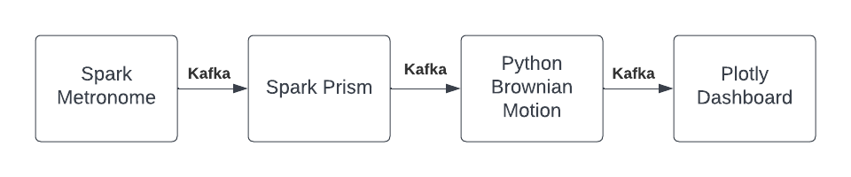

Fireworks is a minimal development environment for denomstration of streaming ETL, Feature Generation, and Real Time Dashboarding. It uses the following stack:

* Development Container (a bastion container with modified DNS)
* Docker-From-Docker access to underlying Docker Engine
* KinD (Kubernetes in Docker)
* Helm
* Kafka (Bitnami)
* Spark (Bitnami)
* Spark Structured Streaming
* Python Kafka Consumer / Producer (librdkafka)
* Plotly Dash

## Getting Started

To demonstrate **Infrustructure as Code** this project implements a Devcontainer (Development Container) using a Dockerfile. The project can be run by 

```
git clone repo && cd k8-spark-kafka && sh bootstrap.sh
```

This will use the Docker Engine to create the Devcontainer, ssh into it, and run the project. It will then forward to localhost:8080 a streaming dashboard.

Alternatively you can run this once inside a VS Code Devcontainer to start the project as well.

```
git clone repo && cd k8-spark-kafka && sh bootstrap.sh
```

The Devcontainer is configured to use IP Tables to resolve Kubernetes internal services using CoreDNS hosted in the Kind Control Plane using the Docker Engine as a bridge. This allows anything run within the Devcontainer to reach local Kubernetes services using the same URL as it would inside the Kubernetes cluster!

i.e. 
```
service_name.namespace.svc.cluster.local
```

This is basically a blanket kubectl proxy command but since it is run within the Devcontainer (and Docker Engine) it is agnostic to the underlying operating system's networking approach. Further this Devcontainer can be used with minimal configuration to forward kubectl commands to any cloud provider (AWS, GCP, etc).

The **Kubernetes** cluster is run using KinD (Kubernetes in Docker). The cluster configuation includes worker nodes to simulate realistic sharding between services.


## Streaming ETL & Stateful Feature Generation

To demonstrate **Streaming ETL** Apache Spark and Apache Kafka are run using Bitnami Helm Charts for minimal configuration and convenience. The Confluent Python library is used to manipulate data retrived from and then written to Kafka. Plotly Dash is used to plot streaming data from Kafka.





### Spark Application

To demontrate a **Spark Application** the first stage in the pipeline uses the Spark Rate-Micro-Batch (new in Spark 3.3) to generate exactly 1 record per second. This simulates a monotonically increasing measurement from some sensor.

This stream is joined to a small table to create multiple sensor readings on the same update frequency. The field DeviceID is used to partition the output before writing to Kafka.

### Python Brownian Motion

To demonstrate **stateful processing of a stream** a Python script is used to merge the N and N-1 events in the event stream coming from a Kafka topic over multiple partitions. The last 100 records sorted by time for each key are kept in memory and a Markov Chain is created for each DeviceID before writing to Kafka.

This is analogous to the lag(1) function provided in Spark SQL which is not available as of 3.3 in streaming mode. Another alternative would be flatMapGroupsWithState from the Scala API which could manage state better for production scenarios.

### Dashboard

To demonstrate **Data Visualization** a Python iterator over a Kafka topic is passed to Plotly Dash callback. Multithreading is used for concurrency in read, queue, and serve. This is packaged in a Dockerfile which is deployed as **Microservice** in the K8 cluster.

The dashboard is available at localhost:8080

