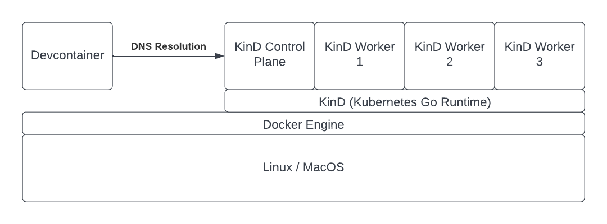
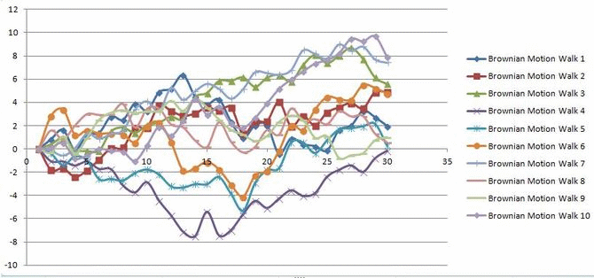

<!--
License
<!-- START Firestream -->
# Firestream
[](https://www.apache.org/licenses/LICENSE-2.0.txt)
[](https://github.com/apache/airflow/actions)
[](https://codecov.io/gh/apache/airflow)
[](https://github.com/psf/black)


<picture width="500">
  
</picture>

[Firestream](https://example.com/firestream/stable/) is a serverless data warehouse designed to fill the gaps left by the abundance of use-case-specific "point" solutions. Think of it as the "create-react-app" for data warehousing, evolving into a comprehensive stack tailored for Data Scientists by Data Engineers.

Even modern solutions like Bytewax require kubernetes to run their own workflows. But what if you need kuber too? Setups differ widely among machines and environments. Local development is sometimes community driven in the case of local stack but not nearly enough community spirit to go around.

Firestream adopts the Dataflow paradigm, ensuring data is touched minimally throughout its lifecycle. Acknowledging that data has gravity and prefers to stay in place, Firestream emphasizes the necessity of highly specific ETL processes required for modern data meshes.

## Key Features
* Declarative Code: Define data transformations using Python, SQL, and natural language specifications.

* ETL Configuration: Customize your ETL jobs in Python with an easy-to-use DSL (Domain Specific Language).

* Reverse Compatibility: Seamlessly integrates with Apache Airflow as the orchestrator, ensuring compatibility with existing workflows.

* Production-Ready Environment: A robust development environment for both stateful and stateless ETL and streaming dashboarding, ready for production deployment with minimal configuration.


# Comps

The best way to understand Firestream is to compare it to the landscape of Data Tools and Cloud Providers

| Tool/Platform            | Cloud Support                  | Runs on a Laptop | Dynamic Scalability | Code your own ETL | Real-Time Streaming Source | Real-Time Streaming Effects | Built on Open Source | Identity Management | User-Friendly Interface         | Kubernetes as a Service | BI Tool Compatible                    |
|--------------------------|--------------------------------|------------------|---------------------|-------------------|----------------------------|----------------------------|-----------------------|----------------------|----------------------------------|------------------------|---------------------------------------|
| Firestream               | Yes, deploy to arbitrary VM(s) | Yes              | Yes                 | Yes               | Webhooks, Websocket, REST  | Webhooks, Websocket, REST  | 100%                  | #TODO                | CLI, IDE (vscode), Services Interfaces | Yes                    | Apache Hive 2.0 API w integrated Catalog |
| Amazon Redshift          | Yes                            | No               | Yes                 | Yes               |                            | No                         | ~90%, postgres        | Yes                  | GUI                              | No                     | Widely Supported                      |
| Google BigQuery          | Yes                            | No               | Yes                 | Yes               |                            | No                         | 0%                    | Yes                  | Yes                              | No                     | Widely Supported                      |
| Microsoft Azure Synapse  | Yes                            | No               | Yes                 | Yes               |                            | No                         | 0%                    | Yes                  | Yes                              | No                     | ?                                     |
| Snowflake                | Yes                            | No               | Yes                 | Yes               |                            | No                         | 0%                    | Yes                  | Yes                              | No                     | Widely Supported                      |
| Databricks               | Yes                            | No               | Yes                 | Yes               |                            | No                         | 90%, spark            | Yes                  | Yes                              | No                     | Widely Supported                      |
| Google Cloud Platform (GCP) | Yes                         | No               | Yes                 | Yes               |                            | With dedicated project     | Extensive             | Yes                  | Yes                              | Yes                    | N/A                                   |
| Amazon Web Services (AWS) | Yes                           | No               | Yes                 | Yes               |                            | With dedicated project     | Extensive             | Yes                  | Yes                              | Yes                    | N/A                                   |


# Table of Contents  
[Tech Stack](#tech-stack)  
[Getting Started](#getting-started)  
[Development Container](#development-container)  
[Apache Spark Structured Streaming](#apache-spark-structured-streaming)  
[Python Stateful Streaming](#python-stateful-streaming)  
[Node.js Middleware](#node-middleware)  
[Plotly.js Dashboard](#plotly-dashboard)  

# Tech Stack

Firestream is powered by these core technologies.

* [Development Container](https://github.com/devcontainers)
* ["Docker-From-Docker"](https://github.com/devcontainers/features/tree/main/src/docker-outside-of-docker)
* [k3s](https://k3s.io/) 
* [k3d](https://github.com/k3d-io/k3d)
* Helm
* [Kafka (Bitnami)](https://github.com/bitnami/charts/tree/main/bitnami/kafka)
* [Spark via Spark Operator](https://github.com/kubeflow/spark-operator)
* [Minio (Bitnami)](https://github.com/bitnami/charts/tree/main/bitnami/minio)


# Getting Started

This project requires Docker and a x86/AMD64 Debian/Ubuntu environment. This project has been tested on Windows WSL Ubuntu 20.04 and Ubuntu 20.04 on bare metal.

This project implements **Infrustructure as Code** via a Devcontainer (Development Container) defined in a Dockerfile. The project can be run using the following command:

```
git clone https://github.com/datawizz/firestream.git && cd firestream && sh bootstrap.sh
```

This will use the Docker Engine of the host and bind to the var/run/docker.sock to create the Devcontainer, open it via a terminal, and bootstrap the project. Once everything is built it will then expose the dashboard on localhost:3000.


# Development Container

Alternatively you can run this project using the VS Code Devcontainer extension. Simply clone the repo, open it in VS Code, and click "open in container" on the bottom left.

The Devcontainer is configured to use IP Tables to resolve Kubernetes internal services using CoreDNS hosted in the Kind Control Plane using the Docker Engine as a bridge on the host's network. This allows anything run within the Devcontainer to reach local Kubernetes services using the same URL as it would inside the Kubernetes cluster!

i.e. 
```
ping service_name.namespace.svc.cluster.local
```
Is resolvable in the Devcontainer.

This is basically a blanket kubectl proxy command but since it is run within the Devcontainer (and Docker Engine) it is agnostic to the underlying operating system's networking approach. Further this Devcontainer can be used with minimal configuration to forward kubectl commands to any cloud provider (AWS, GCP, etc).

The **Kubernetes** cluster is run using KinD (Kubernetes in Docker).




### Apache Spark Structured Streaming

Data is generated using a PySpark application which sends data to the "metronome" topic in Kafka. This application uses the Spark Rate-Micro-Batch (new in Spark 3.3) to generate exactly 1 record per second advanced. This simulates a monotonically increasing measurement from some sensor.

This stream is joined to a small table to create multiple sensor readings on the same update frequency. The field DeviceID is used to partition the output before writing to Kafka.

A second Spark application in Scala reads from the topic "metronome" and performs Stateful Stream Processing in which the N-1 record is compared with the Nth record to find the next advance in the Wiener process. Scala is used here since the "MapGroupsWithState" function is currently only available using the Scala API.

### Python Stateful Streaming

For a comparison of performance a Python application is configured to read data from the "metronome" topic in Kafka. Similar to the Spark Scala application the goal is to merge the N-1 and Nth events in the stream coming from a Kafka topic to demonstrate a Wiener process.

### Node Middleware

Kafka is great for internal communication between microservices but it is not ideal for clients to connect to directly due to the need to secure it and scale it 1-1 with the clients that are connected. Instead a middleware service is implemented which reads the events from Kafka and publishes the events one by one to all connected websocket clients. Events from Kakfa are read and added to a queue. Asynchronously the queue is read and sent to all connected websocket clients.

### Plotly Dashboard

Plotly is a powerful library for data visualization and provides bindings in Python to make a Data Scientist's life easier. But in the realm of quickly updating dashboards the Python layer is simply too slow.

Implemented here is the Plotly JS library rendered client side using NextJS and React. The single page application subscribes to the Websocket connection provided by the middleware and updates events every 100 milliseconds.

The dashboard is available at localhost:8000


