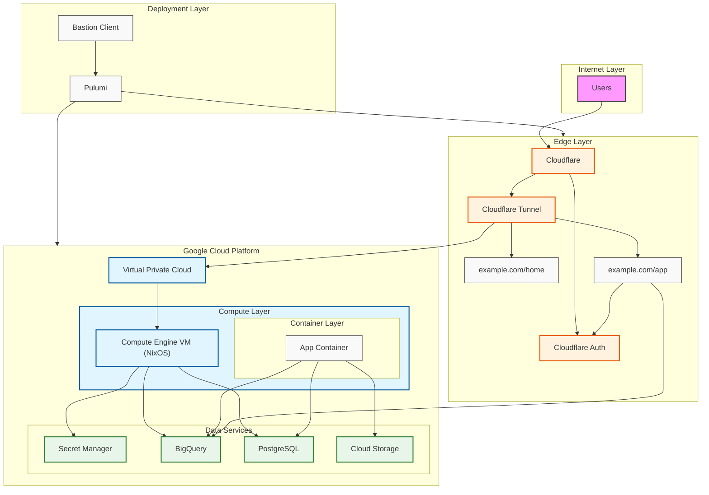

# Standard Deployment

This deployment consists of a Google Cloud Project

1. Cloud Storage Buckets
2. Compute Engine
3. Secrets Manager

Pulumi and Python build scripts create a custom NixOS machine image ready for
deployment in GCP.


# Getting Started

Create a Service Account which Pulumi will use to manage all resources.

# Grant Service Usage Admin role to the Pulumi service account
gcloud projects add-iam-policy-binding pleasantrees-dwh \
    --member="serviceAccount:pulumi@pleasantrees-dwh.iam.gserviceaccount.com" \
    --role="roles/serviceusage.serviceUsageAdmin"

# Additionally, you might also need the Service Management Admin role
gcloud projects add-iam-policy-binding pleasantrees-dwh \
    --member="serviceAccount:pulumi@pleasantrees-dwh.iam.gserviceaccount.com" \
    --role="roles/servicemanagement.admin"


# Secret Management

The makefile assumes a user account with Owner permissions to GCP.
You will login with a browser.

```

```

A service account and associated JSON will be created as part of the build process.
This will be pre-baked into the NixOS image created for the deployment.

Static secrets, i.e. API keys for external services, are pulled from the .env
file and uploaded to Google Secrets Manager. A entrypoint Bash script is
configured to read the secrets and put the .env file in the users home directory.


# User and App

NixOS will be configured with one user, `app` with ~ @ /home/app

Tailscale will be configured for maintenence access.
NixOS will have cloudflared configured with a Tunnel.
The tunnel will be created using Pulumi.

# Steps

0. A human logs in with Owner permission in googel-cloud-sdk
    A human provides API key for tailscale
    A human provides API key for Cloudflare
1. Create service account and Application Credentials
2. Create storage buckets. Note the URL.
3. Create Cloudflare Tunnel. Note the cert.pem
4. Create a tailscale auth-key?
5. Use created credentials to build a NixOS Image. Python Jinja to embed minimal paths and or sops nix
6. Upload the NixOS image to Google Cloud Storage
7. Create a Compute Engine Image from the Cloud Storage NixOS Image
8. Create a Compute Engine VM with the Image


## Diagram



